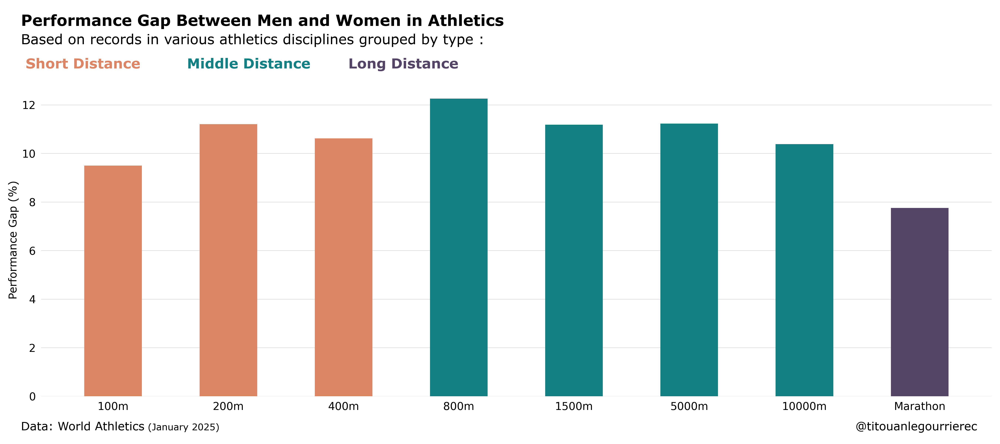

<!---------------------------------------------->

<!---------------------------------------------->
<h1 align="center">
   
  Track The Gap
   
</h1>

    

<!---------------------------------------------->

## 🌄 Overview

This project analyzes the performance differences between male and female athletes in Olympic-level athletics events. By examining historical records, top-20 rankings, and performance trends, we aim to understand where women are closing the gap with men and identify the disciplines where the differences are minimal.

<!---------------------------------------------->

## 🎯 Objectives

* **Track Historical Trends:** Study the evolution of performance records over time.

* **Analyze Performance Records:** Compare male and female world records for various athletics disciplines.

* **Rankings Comparison:** Evaluate the top-20 performances for men and women in each discipline.

* **Performance Gap Analysis:** Measure the performance differences between male and female athletes at each rank within the top-20.

<!---------------------------------------------->

## 📜 Methodology

1. **Data Collection:**
    * Data was scraped from the World Athletics website to ensure accuracy and comprehensiveness.
2. **Data Processing:**
    * Cleaned and organized data for analysis, focusing on world records, historical trends, and top-20 rankings.
3. **Performance Analysis:**
    * Compared male and female performances across disciplines using various statistical methods.
    * Visualized the evolution of records over time.
    * Analyzed rank-based performance gaps within the top-20 rankings.
<!---------------------------------------------->

## 📊 Key Findings

1. **Performance Gaps:**
    * Significant performance differences exist in most disciplines, but the size of the gap varies.
    * Longer distances show smaller gaps (e.g., less than 8% for the marathon and 12% for the 800m), with an average gap around 10%.

    

2. **Historical Trends:**
    * Women's performances have improved at a faster rate in certain disciplines compared to men's, reducing the gap over time.

    

3. **Rank-Based Analysis:**
    * The gap between male and female performances tends to decrease as you move closer to the top ranks (top 1 vs top 20).
    * Male rankings exhibit higher density, with smaller performance differences between ranks compared to female rankings.

    

    

<!---------------------------------------------->

## ⚖️ License

This project is licensed under the **MIT License**. This means you are free to use, modify, and distribute this software. However, the software is provided “as is”, without warranty of any kind.

## 🙏 Acknowledgments

* **World Athletics:** For providing the data used in this analysis.

<!---------------------------------------------->

<a href="#readme-top">back to top</a>

<!---------------------------------------------->

---

> GitHub [@titouanlegourrierec](https://github.com/titouanlegourrierec) &nbsp;&middot;&nbsp;
> Email [titouanlegourrierec@icloud.com](mailto:titouanlegourrierec@icloud.com)
